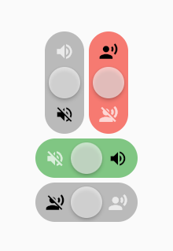

# Slider Switch for Flutter

A Slinding Switch for flutter.



## Getting Started

Add dependency to pubspec.yaml

```
flutter:
    ...
    slider_switch: ^ 0.0.9
    ...
```

add the widget to your code

```
import 'package:slider_switch/slider_switch.dart';

...
SliderSwitch(
    // initialStatus: true, // default: false (false|true)
    // width: 50.0,
    // lenght: 120.0,
    // orientation: Axis.horizontal, // default: Axis.vertical (Axis.vertical|Axis.horizontal)
    statusColorOpacity: 0.7, // default 0.5
    onChanged: (bool value) => print("new speaking value $value"),
    statusOnIcon: Icons.record_voice_over, // default: Icons.volume_up
    statusOffIcon: Icons.voice_over_off, // default: Icons.volume_off
    statusOnColor: Colors.red, // default: Color.green
),
...
```

